# Browser Benchmark Results Summary

*Generated on: 2026-02-28 20:48*

## Overall Score (Privacy vs Performance)

| Engine | Privacy | Performance | Windows/hour | Instances | Bottleneck | Full test s | Startup ms | Bypass % | Bot/Human % |
|-----------------|--------:|------------:|-------------:|----------:|------------|------------:|-----------:|---------:|------------:|
| camoufox_headless__run2 | 65.0 | 54.5 | 17 437.0 | 107 | ram | 22.1 | 3 074.0 | 62.5 | 67.5 |
| camoufox_headless__run3 | 60.5 | 50.7 | 16 236.5 | 101 | ram | 22.4 | 4 381.0 | 50.0 | 71.0 |
| camoufox_headless__run1 | 56.2 | 48.6 | 15 558.7 | 97 | ram | 22.4 | 3 670.0 | 37.5 | 75.0 |
| nodriver-chrome_headless__run2 | 44.2 | 34.6 | 11 079.3 | 99 | cpu | 32.2 | 902.0 | 37.5 | 51.0 |
| tf-playwright-stealth-chromium_headless_with_stealth__run2 | 40.8 | 79.5 | 25 440.5 | 154 | ram | 21.8 | 804.0 | 50.0 | 31.7 |
| tf-playwright-stealth-chromium_headless_with_stealth__run3 | 40.8 | 62.4 | 19 964.2 | 130 | ram | 23.4 | 851.0 | 50.0 | 31.7 |
| playwright-firefox_headless__run3 | 38.8 | 62.6 | 20 034.7 | 125 | ram | 22.5 | 2 355.0 | 37.5 | 40.0 |
| nodriver-chrome_headless__run3 | 38.7 | 46.3 | 14 824.1 | 92 | cpu | 22.3 | 928.0 | 25.0 | 52.3 |
| zendriver-chrome_headless__run2 | 38.3 | 68.1 | 21 807.0 | 130 | ram | 21.5 | 580.0 | 25.0 | 51.7 |
| nodriver-chrome_headless__run1 | 38.3 | 50.3 | 16 108.8 | 100 | cpu | 22.3 | 898.0 | 25.0 | 51.7 |
| selenium-chrome_headless__run1 | 38.1 | 91.7 | 29 332.7 | 174 | ram | 21.4 | 1 741.0 | 37.5 | 38.8 |
| seleniumbase-cdp-chrome__run3 | 37.2 | 50.2 | 16 079.0 | 95 | ram | 21.3 | 1 968.0 | 37.5 | 37.0 |
| seleniumbase-cdp-chrome__run1 | 36.8 | 47.6 | 15 227.7 | 95 | ram | 22.5 | 1 881.0 | 37.5 | 36.0 |
| ulixee-hero_headless__run2 | 35.2 | 73.0 | 23 347.7 | 126 | cpu | 19.4 | 1 427.0 | 25.0 | 45.5 |
| ulixee-hero_headless__run1 | 35.2 | 65.9 | 21 082.2 | 123 | cpu | 21.0 | 1 333.0 | 25.0 | 45.5 |
| playwright-chrome_headless__run1 | 34.6 | 59.0 | 18 884.9 | 113 | ram | 21.5 | 941.0 | 37.5 | 31.8 |
| tf-playwright-stealth-chromium_headless_with_stealth__run1 | 34.6 | 82.1 | 26 258.0 | 158 | ram | 21.7 | 834.0 | 37.5 | 31.7 |
| ulixee-hero_headless__run3 | 34.0 | 55.8 | 17 860.9 | 95 | cpu | 19.1 | 1 415.0 | 12.5 | 55.5 |
| zendriver-chrome_headless__run3 | 31.8 | 65.6 | 21 008.2 | 130 | ram | 22.3 | 602.0 | 12.5 | 51.0 |
| zendriver-chrome_headless__run1 | 31.8 | 61.5 | 19 683.4 | 124 | cpu | 22.7 | 595.0 | 12.5 | 51.0 |
| seleniumbase-cdp-chrome__run2 | 31.0 | 48.8 | 15 610.6 | 98 | ram | 22.6 | 1 872.0 | 25.0 | 37.0 |
| playwright-firefox_headless__run1 | 30.8 | 70.0 | 22 399.4 | 135 | ram | 21.7 | 2 195.0 | 25.0 | 36.5 |
| playwright-firefox_headless__run2 | 30.8 | 60.2 | 19 266.9 | 126 | ram | 23.5 | 2 314.0 | 25.0 | 36.5 |
| seleniumbase-uc-chrome_headless__run2 | 30.6 | 53.2 | 17 011.8 | 115 | ram | 24.3 | 721.0 | 25.0 | 36.3 |
| patchright_headless__run3 | 27.9 | 57.9 | 18 528.6 | 112 | ram | 21.8 | 1 132.0 | 25.0 | 30.8 |
| tf-playwright-stealth-firefox_headless_with_stealth__run2 | 27.5 | 60.4 | 19 329.1 | 121 | ram | 22.5 | 2 639.0 | 25.0 | 30.0 |
| tf-playwright-stealth-firefox_headless_with_stealth__run3 | 27.5 | 59.5 | 19 041.8 | 121 | ram | 22.9 | 2 423.0 | 25.0 | 30.0 |
| tf-playwright-stealth-firefox_headless_with_stealth__run1 | 27.5 | 56.1 | 17 940.0 | 121 | ram | 24.3 | 2 015.0 | 25.0 | 30.0 |
| playwright-chrome_headless__run2 | 26.6 | 58.2 | 18 618.7 | 113 | ram | 21.8 | 927.0 | 25.0 | 28.3 |
| selenium-chrome_headless__run3 | 25.6 | 100.0 | 32 002.3 | 185 | ram | 20.8 | 769.0 | 12.5 | 38.8 |
| selenium-chrome_headless__run2 | 25.6 | 81.2 | 25 996.3 | 158 | ram | 21.9 | 645.0 | 12.5 | 38.8 |
| seleniumbase-uc-chrome_headless__run3 | 24.9 | 55.1 | 17 647.8 | 114 | ram | 23.3 | 736.0 | 12.5 | 37.3 |
| seleniumbase-uc-chrome_headless__run1 | 24.4 | 55.3 | 17 705.4 | 116 | ram | 23.6 | 703.0 | 12.5 | 36.3 |
| playwright-chrome_headless__run3 | 22.1 | 76.3 | 24 404.5 | 146 | ram | 21.5 | 952.0 | 12.5 | 31.8 |
| patchright_headless__run2 | 22.1 | 72.1 | 23 081.3 | 134 | ram | 20.9 | 1 157.0 | 12.5 | 31.8 |
| playwright-connect-over-cdp-chrome_headless__run1 | 20.9 | 50.7 | 16 221.9 | 102 | ram | 22.6 | 1 040.0 | 0.0 | 41.8 |
| playwright-connect-over-cdp-chrome_headless__run2 | 20.4 | 58.3 | 18 648.5 | 110 | ram | 21.2 | 1 291.0 | 0.0 | 40.8 |
| playwright-connect-over-cdp-chrome_headless__run3 | 20.4 | 51.5 | 16 467.6 | 103 | ram | 22.5 | 1 045.0 | 0.0 | 40.8 |
| patchright_headless__run1 | 15.9 | 71.5 | 22 877.5 | 139 | ram | 21.9 | 1 136.0 | 0.0 | 31.8 |

## Overall Bypass Rate

| Engine | Bypass Rate (%) |
|-----------------|----------------:|
| camoufox_headless | 50.0 |
| tf-playwright-stealth-chromium_headless_with_stealth | 45.8 |
| seleniumbase-cdp-chrome | 33.3 |
| nodriver-chrome_headless | 29.2 |
| playwright-firefox_headless | 29.2 |
| playwright-chrome_headless | 25.0 |
| tf-playwright-stealth-firefox_headless_with_stealth | 25.0 |
| ulixee-hero_headless | 20.8 |
| selenium-chrome_headless | 20.8 |
| seleniumbase-uc-chrome_headless | 16.7 |
| zendriver-chrome_headless | 16.7 |
| patchright_headless | 12.5 |
| playwright-connect-over-cdp-chrome_headless | 0.0 |

## Resource Usage Comparison

| Engine | Memory Usage (MB) | CPU Usage (%) |
|-----------------|------------------:|--------------:|
| selenium-chrome_headless | 747.3 | 2.5 |
| tf-playwright-stealth-chromium_headless_with_stealth | 878.0 | 4.9 |
| ulixee-hero_headless | 881.3 | 36.8 |
| zendriver-chrome_headless | 992.0 | 12.3 |
| playwright-firefox_headless | 995.7 | 8.6 |
| patchright_headless | 1005.3 | 4.1 |
| playwright-chrome_headless | 1046.0 | 8.6 |
| tf-playwright-stealth-firefox_headless_with_stealth | 1055.7 | 14.0 |
| seleniumbase-uc-chrome_headless | 1114.3 | 10.3 |
| nodriver-chrome_headless | 1187.0 | 106.5 |
| playwright-connect-over-cdp-chrome_headless | 1220.3 | 11.8 |
| camoufox_headless | 1259.7 | 16.1 |
| seleniumbase-cdp-chrome | 1335.0 | 19.7 |

## Recaptcha Scores

| Engine | Recaptcha Score (0-1) |
|-----------------|--------------------:|
| camoufox_headless | 0.17 |
| ulixee-hero_headless | 0.17 |
| nodriver-chrome_headless | 0.10 |
| playwright-chrome_headless | 0.10 |
| patchright_headless | 0.10 |
| playwright-connect-over-cdp-chrome_headless | 0.10 |
| playwright-firefox_headless | 0.10 |
| seleniumbase-cdp-chrome | 0.10 |
| selenium-chrome_headless | 0.10 |
| seleniumbase-uc-chrome_headless | 0.10 |
| tf-playwright-stealth-chromium_headless_with_stealth | 0.10 |
| tf-playwright-stealth-firefox_headless_with_stealth | 0.10 |
| zendriver-chrome_headless | 0.10 |

## Fingerprint Demo Scores

| Engine | Suspect Score (%) | Raw File |
|-----------------|--------------:|----------:|
| playwright-chrome_headless | 52.67 | results/2026.02.28 20:27/fingerprint_demo/playwright-chrome_headless__run1_signals_code.json |
| patchright_headless | 49.33 | results/2026.02.28 20:27/fingerprint_demo/patchright_headless__run1_signals_code.json |
| seleniumbase-cdp-chrome | 48.33 | results/2026.02.28 20:27/fingerprint_demo/seleniumbase-cdp-chrome__run1_signals_code.json |
| zendriver-chrome_headless | 46.33 | results/2026.02.28 20:27/fingerprint_demo/zendriver-chrome_headless__run1_signals_code.json |
| nodriver-chrome_headless | 45.00 | results/2026.02.28 20:27/fingerprint_demo/nodriver-chrome_headless__run1_signals_code.json |
| seleniumbase-uc-chrome_headless | 43.67 | results/2026.02.28 20:27/fingerprint_demo/seleniumbase-uc-chrome_headless__run1_signals_code.json |
| playwright-firefox_headless | 39.33 | results/2026.02.28 20:27/fingerprint_demo/playwright-firefox_headless__run1_signals_code.json |
| selenium-chrome_headless | 30.00 | results/2026.02.28 20:27/fingerprint_demo/selenium-chrome_headless__run1_signals_code.json |
| playwright-connect-over-cdp-chrome_headless | 20.67 | results/2026.02.28 20:27/fingerprint_demo/playwright-connect-over-cdp-chrome_headless__run1_signals_code.json |
| ulixee-hero_headless | 19.00 | results/2026.02.28 20:27/fingerprint_demo/ulixee-hero_headless__run1_signals_code.json |
| camoufox_headless | 17.00 | results/2026.02.28 20:27/fingerprint_demo/camoufox_headless__run1_signals_code.json |
| tf-playwright-stealth-chromium_headless_with_stealth | nan |  |
| tf-playwright-stealth-firefox_headless_with_stealth | nan |  |

## Navigator Specs (Fingerprint Demo)

| Engine | User Agent | CPU | Memory | Platform | Architecture | Languages | Vendor | Vendor Flavors | OS CPU | Client Hints |
|-----------------|-----------------|----:|-------:|----------|--------------|-----------|--------|----------------|--------|--------------|
| camoufox_headless | Mozilla/5.0 (Windows NT 10.0; Win64; x64; rv:147.0) Gecko/20100101 Firefox/147.0 | 16 | n/a | Win32 | 255 | [["ru-RU"], ["ru-RU", "ru"]] | n/a | [] | Windows NT 10.0; Win64; x64 | {"architecture": {"value": 255}} |
| nodriver-chrome_headless | "Mozilla/5.0 (Macintosh; Intel Mac OS X 10_15_7) AppleWebKit/537.36 (KHTML, like Gecko) C… | 104 | 8 | Linux x86_64 | 255 | [["ru-RU"]] | Google Inc. | ["chrome"] | n/a | {"architecture": {"value": 255}} |
| patchright_headless | Mozilla/5.0 (Windows NT 10.0; Win64; x64) AppleWebKit/537.36 (KHTML, like Gecko) Chrome/1… | 104 | 8 | Linux x86_64 | 255 | [["ru"]] | Google Inc. | [] | n/a | {"architecture": {"value": 255}} |
| playwright-chrome_headless | Mozilla/5.0 (Windows NT 10.0; Win64; x64) AppleWebKit/537.36 (KHTML, like Gecko) Chrome/1… | 104 | 8 | Linux x86_64 | 255 | [["ru"]] | Google Inc. | [] | n/a | {"architecture": {"value": 255}} |
| playwright-connect-over-cdp-chrome_headless | Mozilla/5.0 (X11; Linux x86_64) AppleWebKit/537.36 (KHTML, like Gecko) HeadlessChrome/119… | 104 | 8 | Linux x86_64 | 255 | [["ru-RU"]] | Google Inc. | ["chrome"] | n/a | {"architecture": {"value": 255}} |
| playwright-firefox_headless | Mozilla/5.0 (Windows NT 10.0; Win64; x64; rv:147.0) Gecko/20100101 Firefox/147.0 | 104 | n/a | Linux x86_64 | 255 | [["undefined"], ["undefined"]] | n/a | [] | Linux x86_64 | {"architecture": {"value": 255}} |
| selenium-chrome_headless | Mozilla/5.0 (X11; Linux x86_64) AppleWebKit/537.36 (KHTML, like Gecko) Chrome/144.0.0.0 S… | 104 | 8 | Linux x86_64 | 255 | [["ru"]] | Google Inc. | [] | n/a | {"architecture": {"value": 255}} |
| seleniumbase-cdp-chrome | Mozilla/5.0 (Macintosh; Intel Mac OS X 10_15_7) AppleWebKit/537.36 (KHTML, like Gecko) Ch… | 104 | 8 | Linux x86_64 | 255 | [["ru-RU"]] | Google Inc. | ["chrome"] | n/a | {"architecture": {"value": 255}} |
| seleniumbase-uc-chrome_headless | Mozilla/5.0 (Macintosh; Intel Mac OS X 10_15_7) AppleWebKit/537.36 (KHTML, like Gecko) Ch… | 104 | 8 | Linux x86_64 | 255 | [["ru-RU"]] | Google Inc. | ["chrome"] | n/a | {"architecture": {"value": 255}} |
| tf-playwright-stealth-chromium_headless_with_stealth | n/a | n/a | n/a | n/a | n/a | n/a | n/a | n/a | n/a | n/a |
| tf-playwright-stealth-firefox_headless_with_stealth | n/a | n/a | n/a | n/a | n/a | n/a | n/a | n/a | n/a | n/a |
| ulixee-hero_headless | Mozilla/5.0 (Windows NT 10.0; Win64; x64) AppleWebKit/537.36 (KHTML, like Gecko) Chrome/1… | 104 | 2 | Win32 | 255 | [["en-US"]] | Google Inc. | ["chrome"] | n/a | {"architecture": {"value": 255}} |
| zendriver-chrome_headless | "Mozilla/5.0 (Macintosh; Intel Mac OS X 10_15_7) AppleWebKit/537.36 (KHTML, like Gecko) C… | 104 | 8 | Linux x86_64 | 255 | [["ru-RU"]] | Google Inc. | ["chrome"] | n/a | {"architecture": {"value": 255}} |

## IP (Ipify) 

| Engine | IP |
|-----------------|----------:|
| camoufox_headless | Not detected |
| nodriver-chrome_headless | Not detected |
| patchright_headless | Not detected |
| playwright-chrome_headless | Not detected |
| playwright-connect-over-cdp-chrome_headless | Not detected |
| playwright-firefox_headless | Not detected |
| selenium-chrome_headless | Not detected |
| seleniumbase-cdp-chrome | Not detected |
| seleniumbase-uc-chrome_headless | Not detected |
| tf-playwright-stealth-chromium_headless_with_stealth | Not detected |
| tf-playwright-stealth-firefox_headless_with_stealth | Not detected |
| ulixee-hero_headless | Not detected |
| zendriver-chrome_headless | Not detected |

## Visual Dashboard

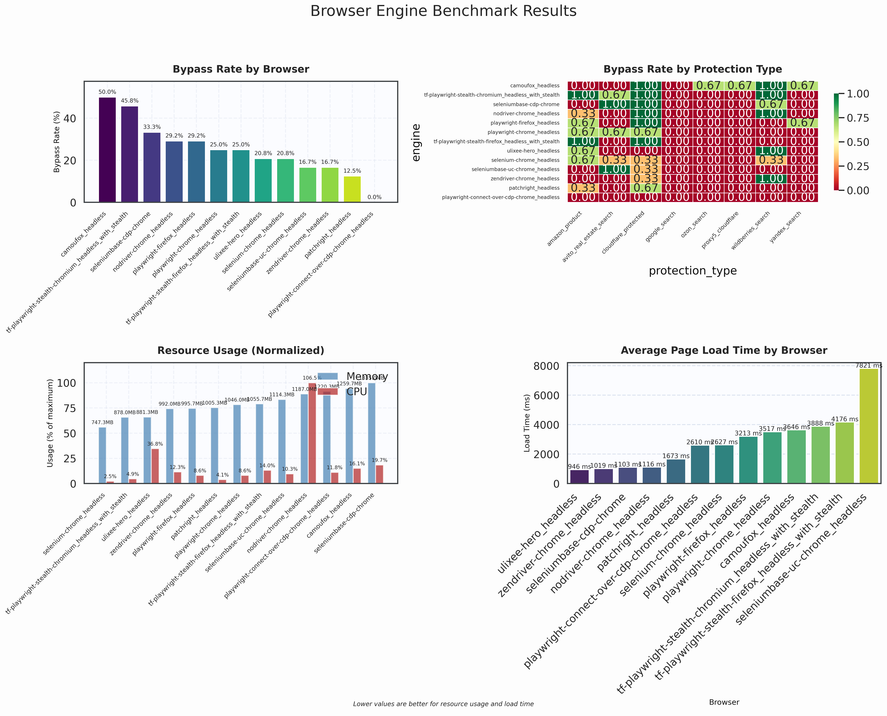

## Timings Dashboard

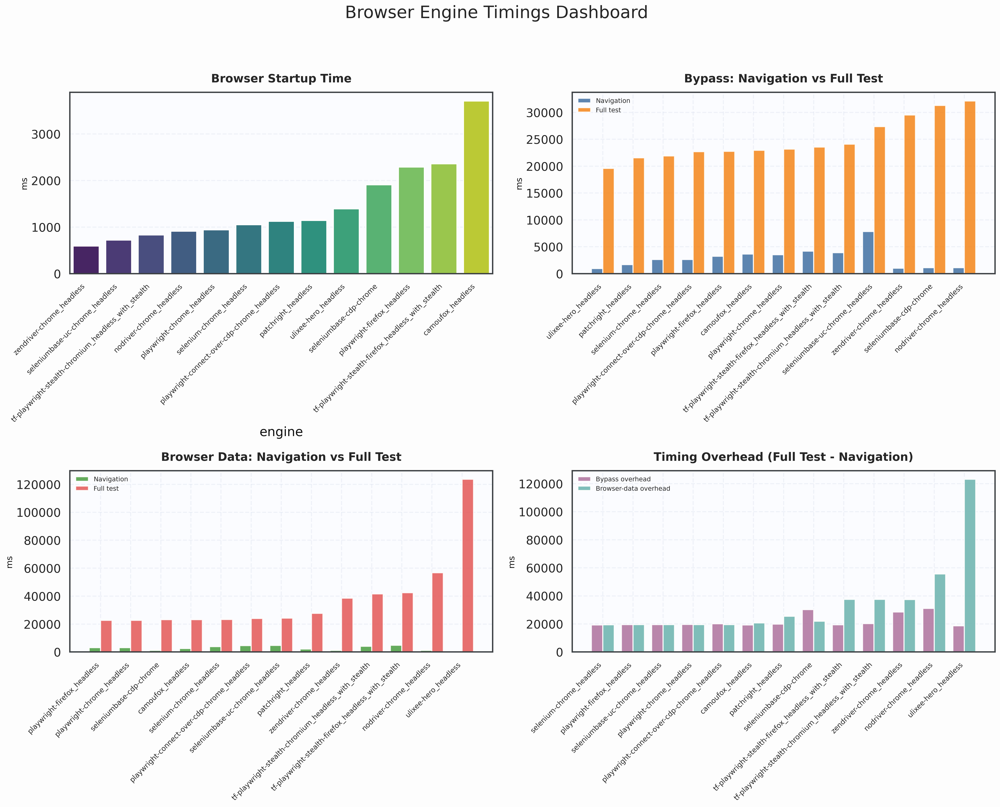

## Bypass Detailed Charts

### Bypass Rate

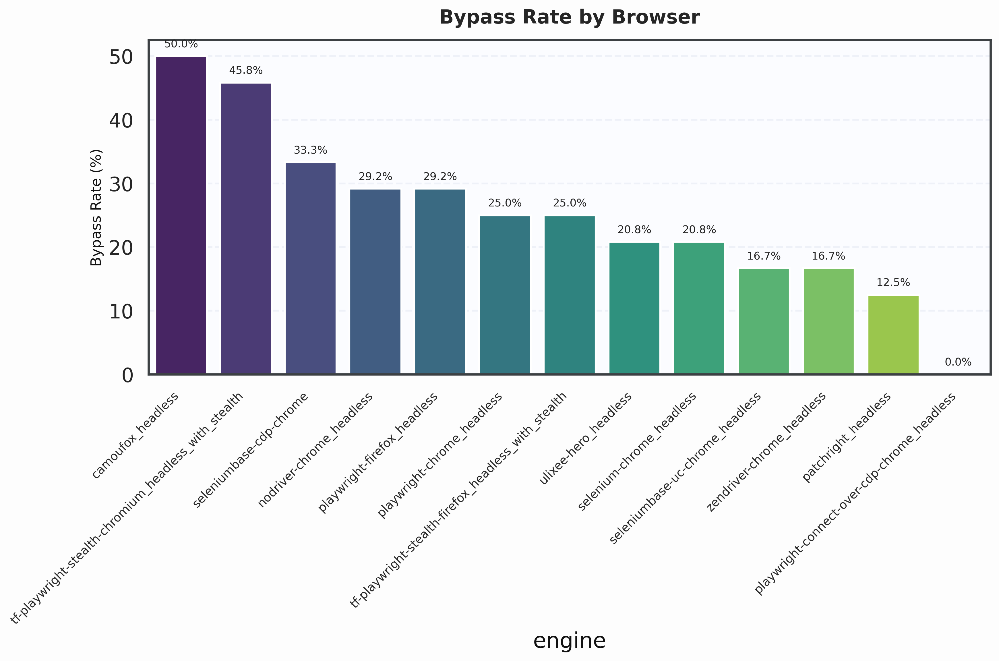

### Bypass Protection Heatmap

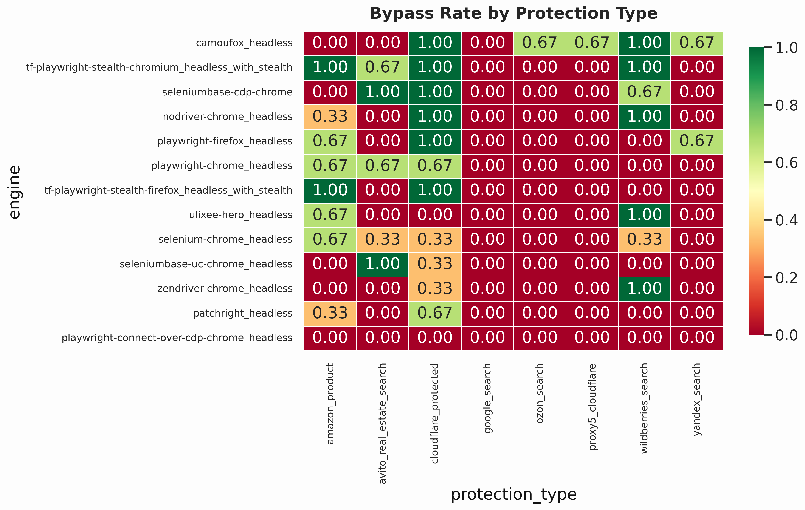

### Bypass Resource Usage

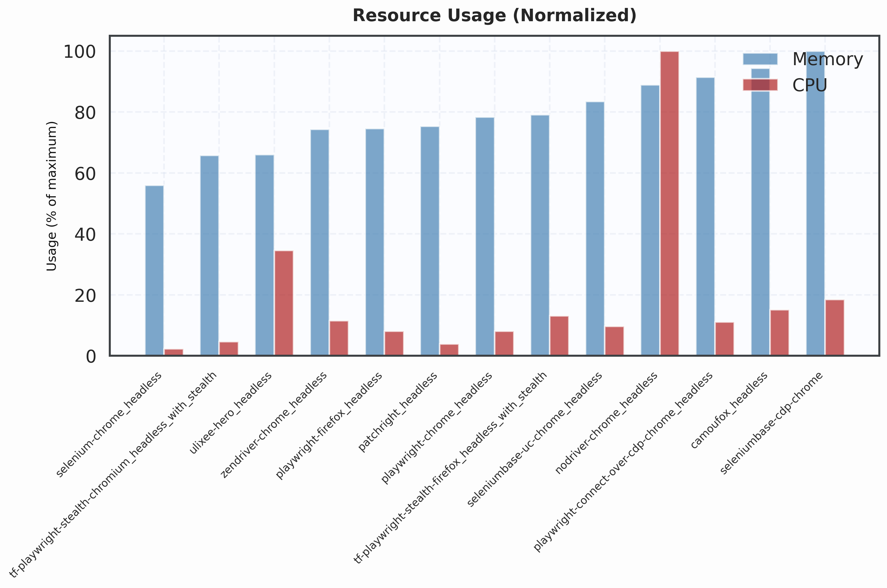

### Bypass Load Time

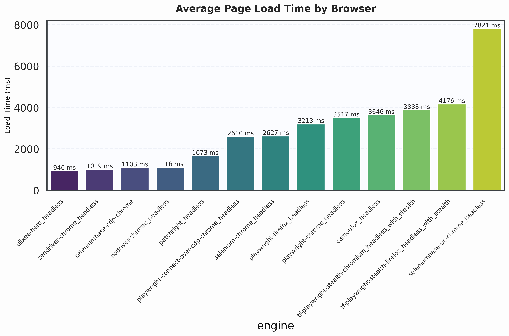

## Timings Detailed Charts

### Startup Time

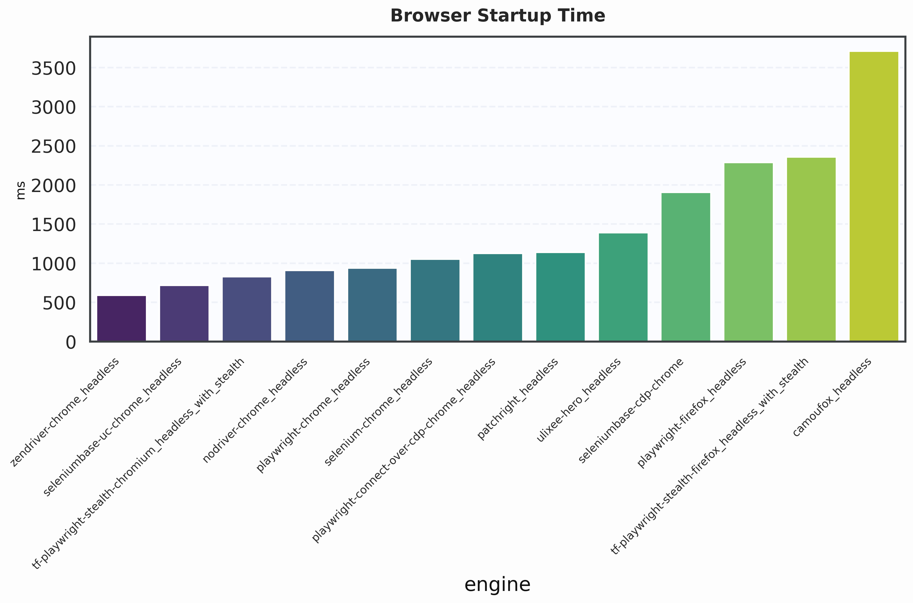

### Bypass Navigation vs Full Test

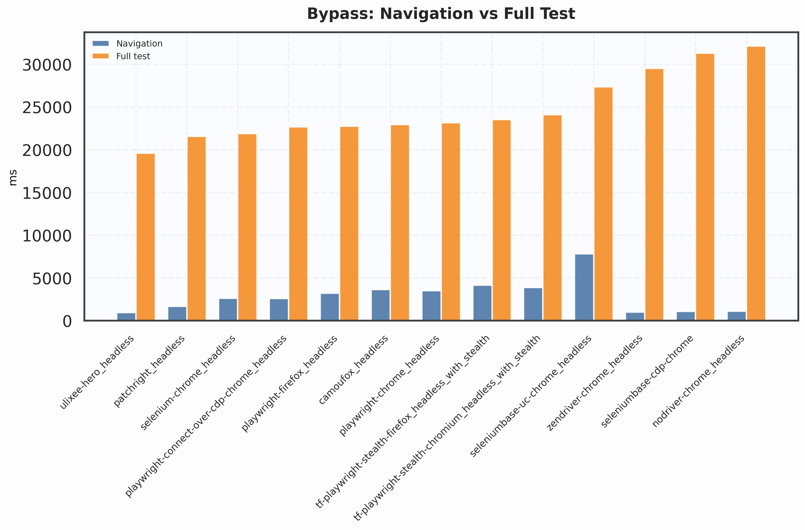

### Browser Data Navigation vs Full Test

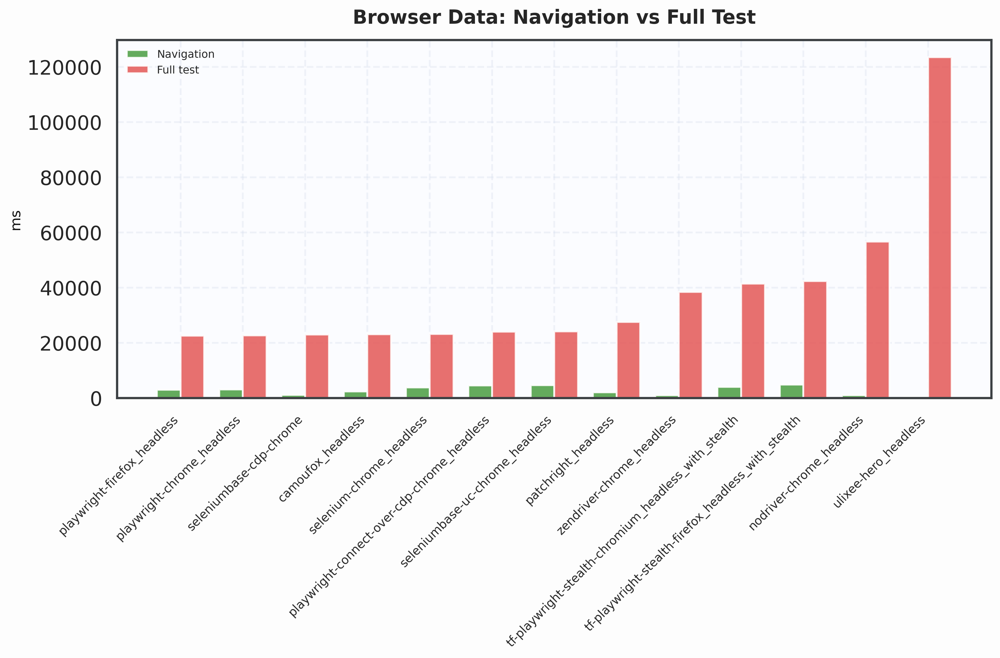

### Timing Overhead

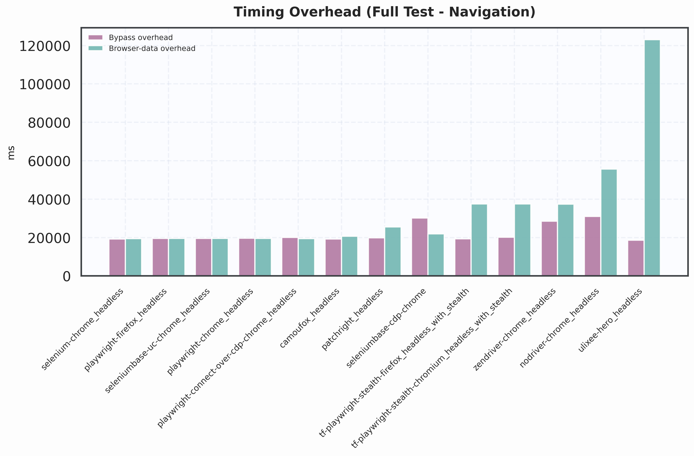

## Recaptcha Score Visualization

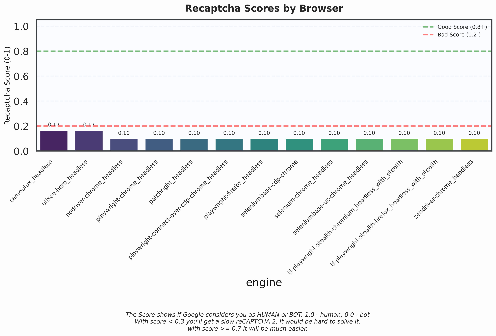

## Fingerprint Demo Visualization

## Fingerprint Demo (Browser Smart Signals)

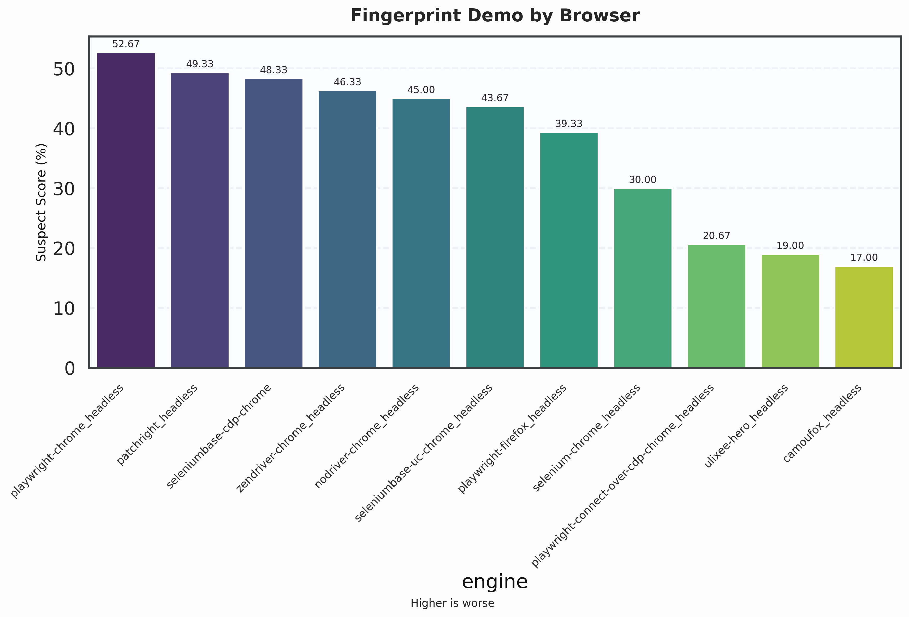

## Incolumitas Visualization

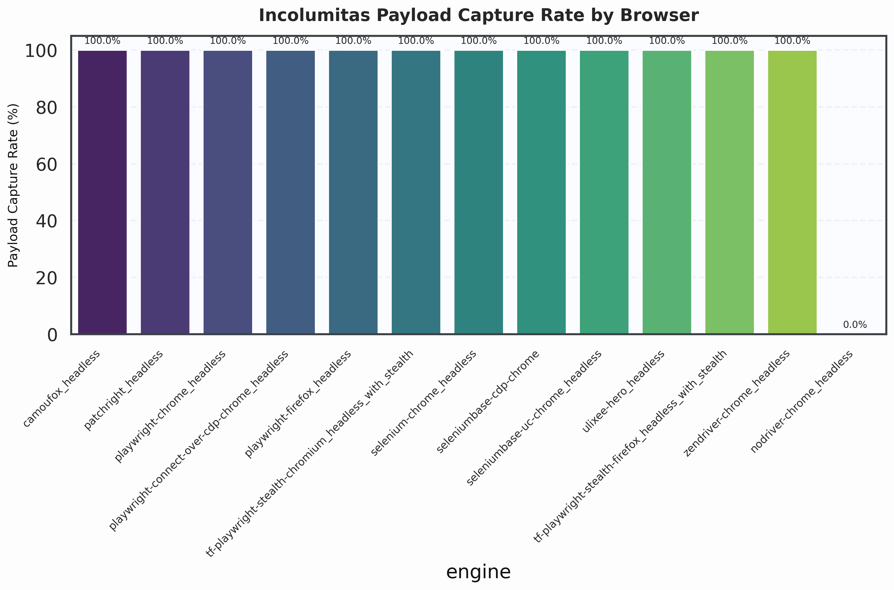

## DeviceAndBrowserInfo Visualization

## Fingerprint Scan Visualization

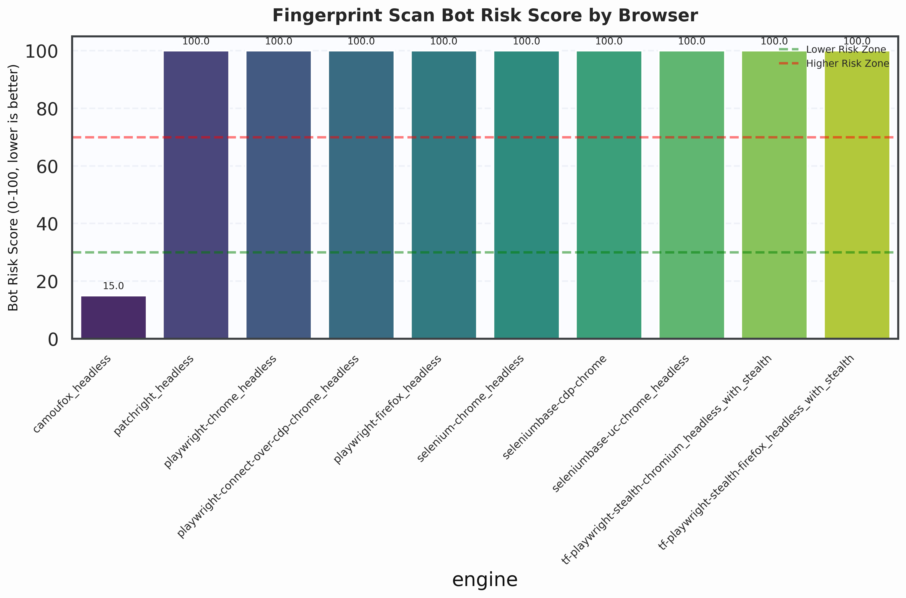

