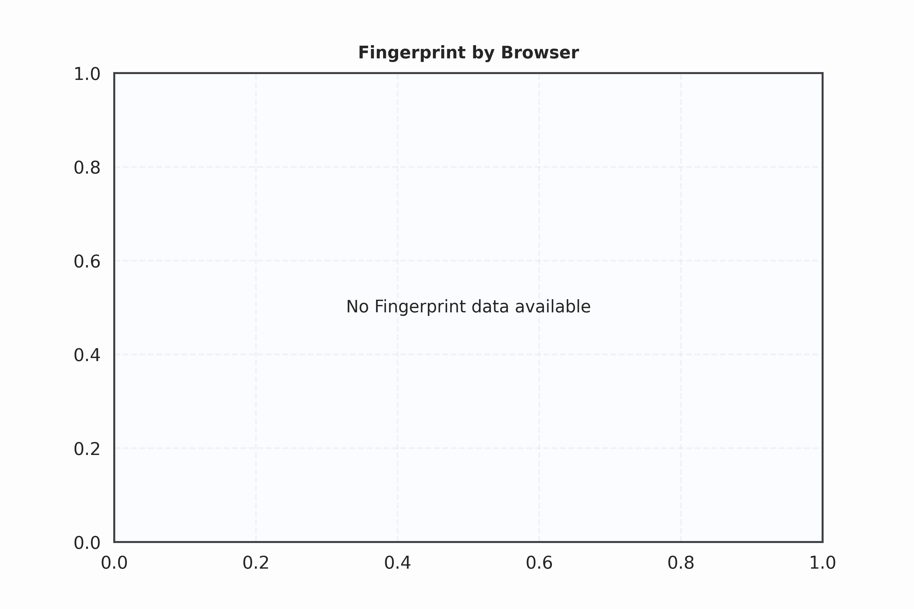
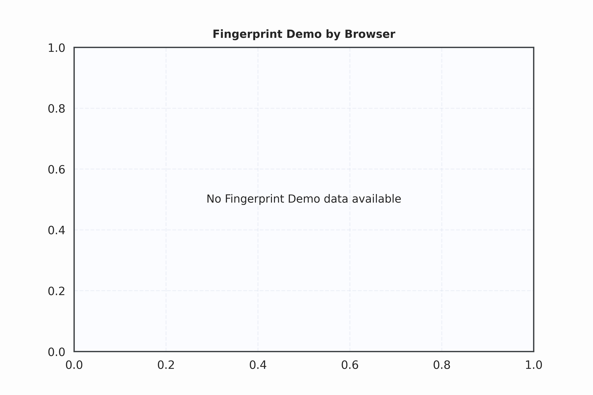
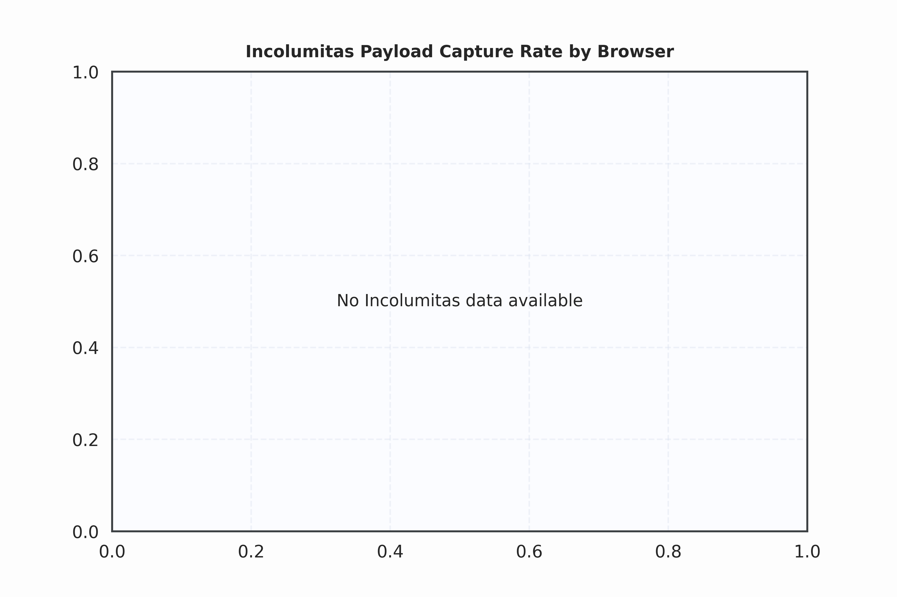
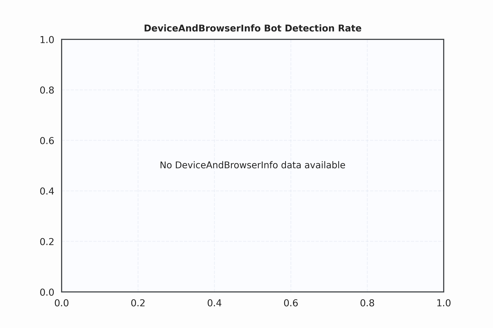
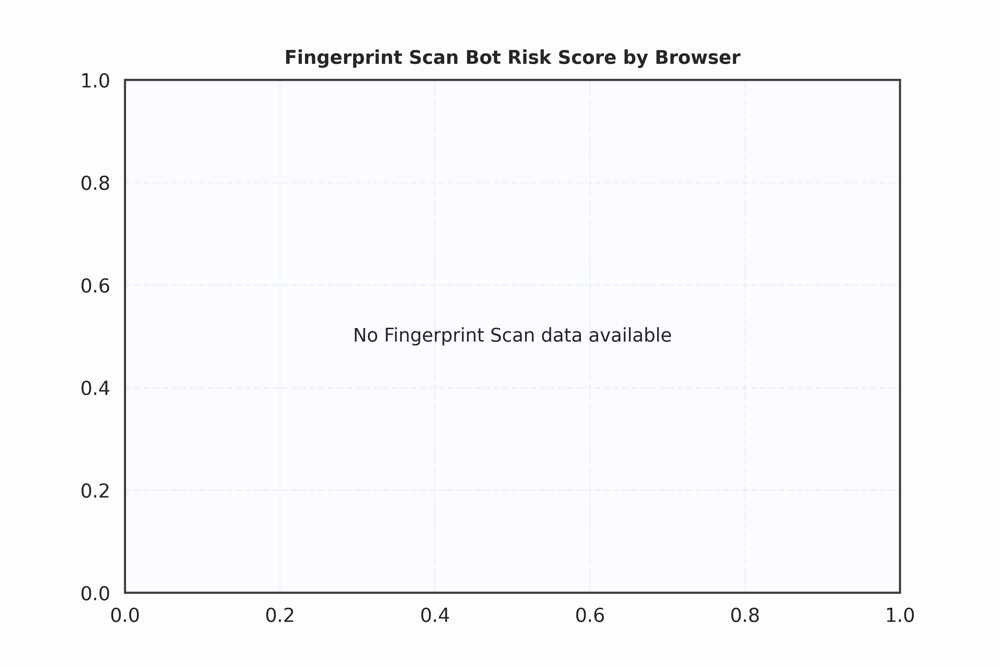

# Browser Benchmark Results Summary

*Generated on: 2026-02-28 06:17*

## Overall Bypass Rate

| Engine | Bypass Rate (%) |
|-----------------|----------------:|
| camoufox_headless | 25.0 |
| nodriver-chrome | 25.0 |
| playwright-firefox | 25.0 |
| tf-playwright-stealth-firefox_headless | 25.0 |
| tf-playwright-stealth-chromium | 25.0 |
| camoufox | 12.5 |
| nodriver-chrome_headless | 12.5 |
| playwright-firefox_headless | 12.5 |
| selenium-chrome__no_proxy | 12.5 |
| playwright-chrome_headless | 12.5 |
| patchright | 12.5 |
| tf-playwright-stealth-chromium_headless | 12.5 |
| tf-playwright-stealth-firefox | 12.5 |
| seleniumbase-cdp-chrome | 12.5 |
| selenium-chrome_headless__no_proxy | 12.5 |
| zendriver-chrome | 12.5 |
| zendriver-chrome_headless | 12.5 |
| patchright_headless | 0.0 |
| playwright-chrome | 0.0 |

## Resource Usage Comparison

| Engine | Memory Usage (MB) | CPU Usage (%) |
|-----------------|------------------:|--------------:|
| playwright-chrome_headless | 212.0 | 4.9 |
| tf-playwright-stealth-chromium_headless | 298.0 | 9.4 |
| selenium-chrome_headless__no_proxy | 354.0 | 11.5 |
| zendriver-chrome | 364.0 | 10.2 |
| seleniumbase-cdp-chrome | 375.0 | 14.0 |
| zendriver-chrome_headless | 424.0 | 13.4 |
| playwright-chrome | 454.0 | 20.2 |
| tf-playwright-stealth-chromium | 462.0 | 19.8 |
| selenium-chrome__no_proxy | 519.0 | 15.5 |
| nodriver-chrome_headless | 547.0 | 20.0 |
| nodriver-chrome | 554.0 | 19.0 |
| patchright_headless | 560.0 | 12.6 |
| playwright-firefox_headless | 606.0 | 28.1 |
| tf-playwright-stealth-firefox | 659.0 | 26.4 |
| patchright | 709.0 | 19.2 |
| tf-playwright-stealth-firefox_headless | 822.0 | 46.2 |
| camoufox | 1007.0 | 43.5 |
| playwright-firefox | 1012.0 | 51.7 |
| camoufox_headless | 1037.0 | 45.5 |

## Recaptcha Scores

| Engine | Recaptcha Score (0-1) |
|-----------------|--------------------:|
| patchright | 0.30 |
| camoufox | 0.10 |
| camoufox_headless | 0.10 |
| patchright_headless | 0.10 |
| playwright-chrome | 0.10 |
| playwright-firefox | 0.10 |
| playwright-firefox_headless | 0.10 |
| seleniumbase-cdp-chrome | 0.10 |
| tf-playwright-stealth-chromium | 0.10 |
| tf-playwright-stealth-chromium_headless | 0.10 |
| tf-playwright-stealth-firefox | 0.10 |
| tf-playwright-stealth-firefox_headless | 0.10 |
| nodriver-chrome | nan |
| nodriver-chrome_headless | nan |
| playwright-chrome_headless | nan |
| selenium-chrome__no_proxy | nan |
| selenium-chrome_headless__no_proxy | nan |
| zendriver-chrome | nan |
| zendriver-chrome_headless | nan |

## Fingerprint Demo Scores

*No Fingerprint demo data available*

## Navigator Specs (Fingerprint Demo)

*No fingerprint demo files available*

## IP (Ipify) 

| Engine | IP |
|-----------------|----------:|
| camoufox | 179.60.189.65 |
| camoufox_headless | 142.168.221.86 |
| nodriver-chrome | 181.188.19.203 |
| nodriver-chrome_headless | 38.13.154.130 |
| patchright | 73.10.95.50 |
| patchright_headless | 108.153.53.3 |
| playwright-chrome | 31.48.214.36 |
| playwright-chrome_headless | 45.188.194.209 |
| playwright-firefox | 142.168.221.86 |
| playwright-firefox_headless | 165.238.24.218 |
| selenium-chrome__no_proxy | 149.102.240.75 |
| selenium-chrome_headless__no_proxy | 149.102.240.75 |
| seleniumbase-cdp-chrome | 207.146.227.90 |
| tf-playwright-stealth-chromium | 37.5.253.239 |
| tf-playwright-stealth-chromium_headless | 204.204.177.118 |
| tf-playwright-stealth-firefox | 208.32.186.48 |
| tf-playwright-stealth-firefox_headless | 204.205.129.70 |
| zendriver-chrome | 207.146.227.90 |
| zendriver-chrome_headless | 204.205.78.214 |

## Visual Dashboard

## Recaptcha Score Visualization

## Fingerprint Demo Visualization

## Fingerprint Demo (Browser Smart Signals)

## Incolumitas Visualization

## DeviceAndBrowserInfo Visualization

## Fingerprint Scan Visualization

